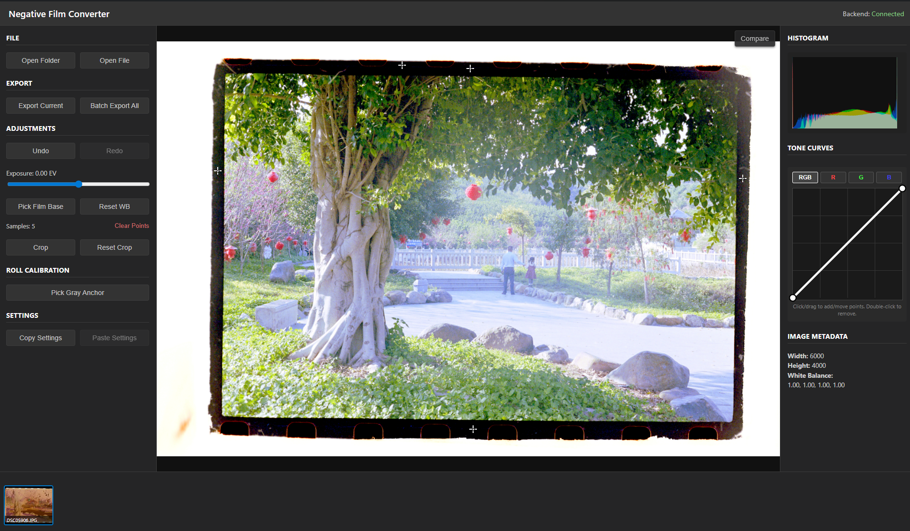

# Negative Film Converter

A professional-grade, data-driven tool for converting scanned color negative film into high-quality digital positive images. Built with **Tauri v2**, **React**, and a **Python (FastAPI)** backend.

 

## 🚀 Key Features

- **RAW Support**: Native support for most camera RAW formats (.arw, .nef, .cr2, .dng) via `rawpy`.
- **Precision Math**: Uses logarithmic density models (Hurter-Driffield curve) for physically accurate film inversion.
- **Roll Calibration**: Sample neutral gray points across multiple images to fit a custom logarithmic curve for an entire film roll, ensuring consistent color across shots.
- **Interactive Tone Curves**: RGB & Master spline-based curve editing using Pchip interpolation for smooth, overshoot-free tonal adjustments.
- **Viewport Interaction**:
  - High-performance Zoom & Pan (GPU-accelerated).
  - **Hold-to-Compare**: Instantly toggle between the negative and positive views (Spacebar/Key).
  - **Non-Destructive Cropping**: Define crop areas that are applied only during final export.
- **Workflow Tools**: 
  - Folder-based film strip with fast, downscaled thumbnails.
  - Sidecar `.json` metadata for persistent settings (Exposure, WB, Curves, Crop).
  - Manual film base (White Balance) picker.
  - Real-time interactive histogram.
- **High Performance**: Asynchronous backend processing with float32 precision and strategic caching for a fluid editing experience.
- **Batch Export**: Efficiently export high-quality JPEGs from entire rolls with all adjustments applied.

## 🛠️ Technology Stack

- **Frontend**: React, TypeScript, Vite, TailwindCSS.
- **Desktop Framework**: Tauri v2 (Rust).
- **Backend**: Python 3.11+, FastAPI, Uvicorn.
- **Image Processing**: `rawpy` (RAW decoding), `NumPy` (high-speed array math), `OpenCV` (LUTs and final processing), `SciPy` (curve fitting and spline interpolation).

## 📂 Documentation Summary

The `docs/` folder contains detailed technical documentation and the project's evolution history:

### 🔬 Algorithms & Science
- **[Converting The Math](file:///docs/algorithms/Converting_The_Math.md)**: Deep dive into photographic densitometry, transmittance-to-exposure conversion, and dye crosstalk correction.

### 🏗️ Implementation Phases
- **Phase 1: Setup**: Sidecar architecture and basic RAW loading.
- **Phase 2: Core**: Manual WB, Histogram, and Auto-Levels.
- **Phase 3: Workflow**: Film strip, settings persistence, and batch export.
- **Advanced Tonal Control**: Detailed plans for **Roll-Level Curve Fitting** and the **Interactive Tone Curve Editor**.
- **UX & Performance**: Plans for **Viewport Interaction (Zoom/Pan/Crop)** and **Backend Async Performance**.
- **Refinement**: Fusing data-driven calibration into the core floating-point pipeline for ultimate color fidelity.

### 📦 Release & Deployment
- **[Windows Release Guide](file:///docs/release/windows-release-guide.md)**: Instructions for compiling the Python backend and building the Windows installer.

## 🏃 Getting Started

### Prerequisites

- [Node.js](https://nodejs.org/)
- [Rust](https://www.rust-lang.org/)
- [Python 3.11+](https://www.python.org/)

### Setup

1. **Clone the repository**:
   ```bash
   git clone https://github.com/your-repo/negative-converter.git
   cd negative-converter
   ```

2. **Backend Setup**:
   ```bash
   cd backend
   python -m venv venv
   source venv/bin/activate  # On Windows: venv\Scripts\activate
   pip install -r requirements.txt
   ```

3. **Frontend Setup**:
   ```bash
   npm install
   ```

4. **Run Development Server**:
   ```bash
   npm run tauri dev
   ```

## 📜 License

MIT License - See [LICENSE](LICENSE) for details.
